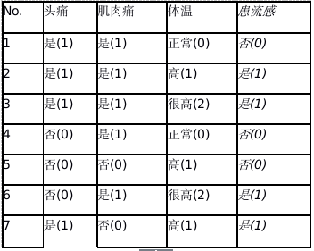
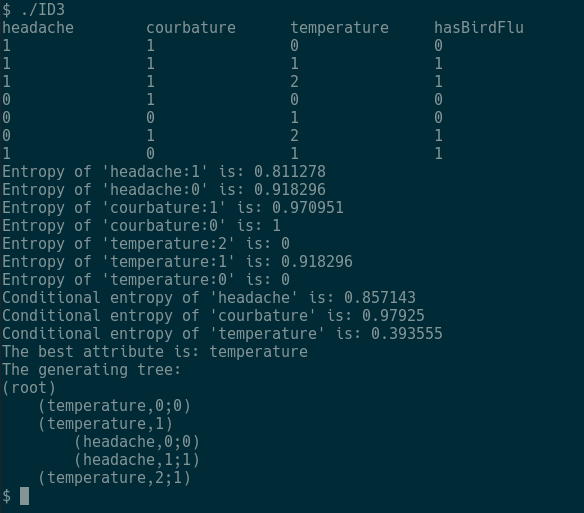

# ID3-Implement
=============

A sample implement of ID3 algorithm, based on a bird flu samples, coded by C++ 11.

## Samples
### Records
The samples are seven records of whether having bir flu and their state of each feature.

All the records are shown by the following picture:



### Record file
For easily access the records, I use integer to identify the state of each feature.Each value's meaning can be found in the above picture.

The records are storaged in the file './source/samples.txt', which contains the following content:
```
headache     courbature      temperature    hasBirdFlu
1            1               0              0
1            1               1              1
1            1               2              1
0            1               0              0
0            0               1              0
0            1               2              1
1            0               1              1
```

## Screenshots

The following picture shows the process of program:


As you can see, some calculation process are displayed.And at the end, the program outputs a decision tree, which generated by ID3 algorithm.
